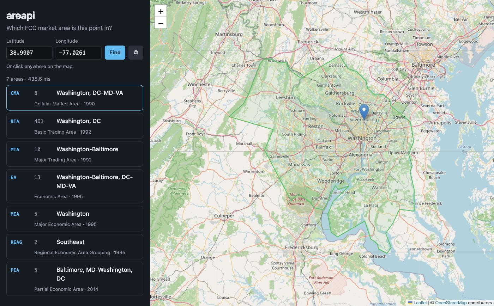

# areapi

[](https://www.npmjs.com/package/@brianfunk/areapi)
[](https://github.com/brianfunk/areapi/actions/workflows/ci.yml)
[](https://app.netlify.com/projects/areapi/deploys)
[](LICENSE)

**Which FCC market area is this point in?**

Give it a latitude and longitude, get back the Cellular Market Area, Basic Trading Area, Major Trading Area, Economic Area, Major Economic Area, Regional Economic Area Grouping and Partial Economic Area that contain it. These are the geographies the FCC uses to license wireless spectrum.

- **Website:** https://areapi.netlify.app
- **API:** https://areapi.netlify.app/api/find?lat=38.9907&lon=-77.0261
- **npm:** `npm install @brianfunk/areapi` or `npx @brianfunk/areapi 38.9907 -77.0261`

[](https://areapi.netlify.app/?lat=38.9907&lon=-77.0261)

No database, no server-side state, zero runtime dependencies. The polygons are simplified GeoJSON shipped with the package (about 3 MB for all seven types) and the point-in-polygon test is forty lines of ray casting.

```
$ npx @brianfunk/areapi 38.9907 -77.0261
point   38.9907, -77.0261
status  OK
CMA     8  Washington, DC-MD-VA
BTA   461  Washington, DC
MTA    10  Washington-Baltimore
EA     13  Washington-Baltimore, DC-MD-VA
MEA     5  Washington
REAG    2  Southeast
PEA     5  Baltimore, MD-Washington, DC
```

## Area types

| type | name | count | vintage | defined by |
| --- | --- | ---: | --- | --- |
| `cma` | Cellular Market Area | 734 | 1990 | 306 MSAs (incl. Gulf of Mexico) + 428 RSAs, FCC PN CL-92-40 |
| `bta` | Basic Trading Area | 493 | 1992 | Rand McNally Commercial Atlas, as modified by the FCC |
| `mta` | Major Trading Area | 51 | 1992 | Rand McNally Commercial Atlas, as modified by the FCC |
| `ea` | Economic Area | 176 | 1995 | BEA Economic Areas 1-172 + FCC 173-176 |
| `mea` | Major Economic Area | 52 | 1995 | 47 CFR 27.6 |
| `reag` | Regional Economic Area Grouping | 12 | 1995 | 47 CFR 27.6 |
| `pea` | Partial Economic Area | 416 | 2014 | FCC PN DA 14-759 |

All of them are complete, including Puerto Rico, the U.S. Virgin Islands, Guam, the Northern Mariana Islands and American Samoa. The Gulf of Mexico (CMA 306, EA 176, MEA 52, REAG 12) is a water-only market; its polygon is the U.S. part of the Gulf from Marine Regions, which runs from the coastline out to the EEZ limit. (The FCC draws the EA/MEA/REAG Gulf boundary 12 nautical miles offshore rather than at the coast; that strip is attributed to the Gulf here.)

## HTTP API

```
GET /api/find?lat=<lat>&lon=<lon>[&types=cma,bta,...][&format=json|xml|jsonp][&callback=fn]
GET /api/<type>/find?latitude=<lat>&longitude=<lon>
GET /api/types
```

| parameter | required | values | default |
| --- | --- | --- | --- |
| `lat` (or `latitude`) | yes | -90 to 90 | |
| `lon` (or `longitude`, `lng`) | yes | -180 to 180 | |
| `types` | no | comma-separated subset of the types above | all |
| `format` | no | `json`, `xml`, `jsonp` | `json` |
| `callback` | no | JSONP callback name | `callback` |

```json
{
  "status": "OK",
  "point": { "lat": 38.9907, "lon": -77.0261 },
  "types": ["cma", "bta"],
  "areas": [
    { "type": "cma", "id": "8", "name": "Washington, DC-MD-VA", "vintage": "1990" },
    { "type": "bta", "id": "461", "name": "Washington, DC", "vintage": "1992" }
  ],
  "executionTime": 1.2
}
```

`status` is `OK`, `NONE` (no area contains the point) or `ERROR` (HTTP 400 with an `error` message). Responses are CORS-enabled and cacheable for a day. The 2017 URL shape `/api/<type>/<year>/find` still works; the year is ignored.

## Library

```js
import { find, feature, types } from '@brianfunk/areapi';

const r = await find({ lat: 38.9907, lon: -77.0261 });                 // every type
const r = await find({ lat: 38.9907, lon: -77.0261 }, { types: 'cma' }); // one or more
const f = await feature('cma', 8);   // GeoJSON Feature with geometry and bbox, for drawing
const m = await types();             // manifest: counts, vintages, sources
```

Ships TypeScript declarations. Works in Node 20+ and in the browser. In the browser, call `setDataUrl('/path/to/data/')` so it knows where to fetch the `<type>.json` files from; they are loaded lazily, one type at a time, and cached.

## CLI

```
areapi <lat> <lon> [--types cma,bta,...] [--format table|json|xml]
areapi --list
```

Prints a table on a terminal and JSON when piped. Exit code 0 when at least one area matched, 3 when none did, 2 on bad input.

## How the data is built

Every FCC market area is an aggregation of county-equivalents, so the polygons are built by dissolving county boundaries with the FCC's own county-to-market crosswalk rather than by redistributing the FCC shapefiles (which the FCC no longer publishes for most types).

| input | source |
| --- | --- |
| County boundaries | U.S. Census Bureau, Census 2000 generalized counties (`co99_d00`), plus the 2020 1:500k cartographic file for the four territories missing from the 2000 file |
| County → market crosswalk | FCC OET `FCCCNTY2K.txt` (CMA, BTA, MTA, EA, MEA, REA per county FIPS) |
| PEA polygons | FCC `FCC_PEAs_Website.zip` shapefile |
| Gulf of Mexico | Marine Regions (VLIZ) EEZ × IHO sea areas, "United States part of the Gulf of Mexico" (MRGID 25281) |
| Market names | FCC Universal Licensing System public data (`l_market.zip`, market table) |

To rebuild from scratch:

```sh
mkdir -p data/raw && cd data/raw
curl -O https://www2.census.gov/geo/tiger/PREVGENZ/co/co00shp/co99_d00_shp.zip
curl -O https://www2.census.gov/geo/tiger/GENZ2020/shp/cb_2020_us_county_500k.zip
curl -O https://transition.fcc.gov/bureaus/oet/info/maps/areas/data/2000/FCCCNTY2K.txt
curl -O https://transition.fcc.gov/bureaus/oet/info/maps/areas/data/FCC_PEAs_Website.zip
curl -O https://data.fcc.gov/download/pub/uls/complete/l_market.zip
curl -o eez_iho_gulf.json "https://geo.vliz.be/geoserver/MarineRegions/wfs?service=WFS&version=1.0.0&request=GetFeature&typeName=MarineRegions:eez_iho&outputFormat=json&CQL_FILTER=marregion%20ILIKE%20%27%25Gulf%20of%20Mexico%25%27"
unzip -p l_market.zip MK.dat | awk -F'|' '{print $6 "|" $9}' | sort -u > uls-markets.txt
cd ../..
node scripts/extract-names.js   # -> scripts/names.json
npm run build:data              # -> data/*.json, data/manifest.json
```

Geometry is simplified (`SIMPLIFY=5%` by default, visvalingam weighted, shapes preserved) and rounded to 4 decimal places, which is about 11 m. That is plenty for deciding which market a point is in, and is what keeps the whole dataset at 3 MB. `data/manifest.json` records the sources, counts, and the ids that have no polygon.

## Development

```sh
npm install
npm test            # node:test, no framework
npm run build:site  # bundle src/ for the browser + copy data into site/
npm run dev         # netlify dev: site + API function at http://localhost:8888
```

Deployed on Netlify from the `dev` branch. The site is static files; the API is one Netlify Function wrapping the same library.

## License

MIT
